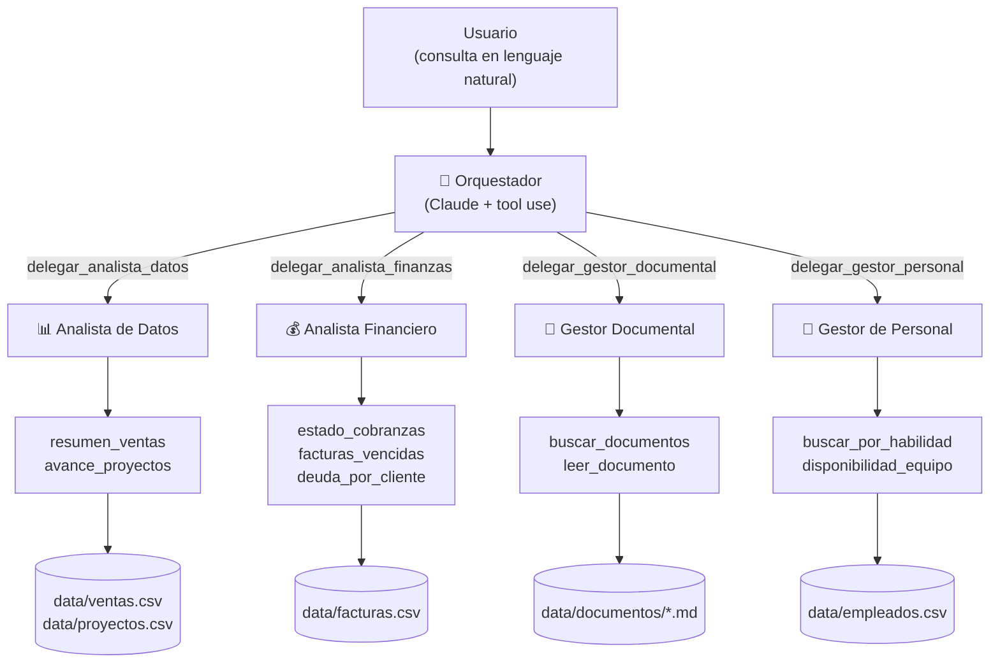

# Enterprise Agent Suite — Caso de uso IA 2026

Suite **agéntica de gestión empresarial** que demuestra la capacidad de
construir soluciones de IA aplicadas a los dominios de negocio de la empresa:
**analítica de datos**, **finanzas**, **gestión documental** y **gestión de personal**.

Un agente **orquestador** recibe consultas en lenguaje natural, las delega en agentes
**especialistas** (cada uno con sus propias herramientas sobre los datos de la empresa)
y sintetiza una única respuesta. Se usa por **CLI**, por **chat web**, por **API HTTP**,
con **tablero de control** de alertas tempranas y una **versión móvil con chat de voz**.



## Stack implementado

| Capa | Tecnología | Detalle |
|---|---|---|
| Lenguaje | Python ≥ 3.10 | probado en 3.10 y 3.12 (CI) |
| Modelo de IA | Claude (`claude-opus-5`) | vía SDK oficial `anthropic`, tool use, razonamiento adaptativo |
| Núcleo agéntico | propio | orquestador + 4 especialistas, capa `LLMClient` con cliente real y mock |
| API / web | FastAPI + uvicorn | REST (`/consultar`, `/metricas`), páginas protegidas por sesión |
| Autenticación | propia | PBKDF2-HMAC-SHA256, cookie de sesión HttpOnly, RBAC de 3 roles |
| Design system | propio (`ds.css` + `ds.js`) | tokens estilo Material 3, tema claro/oscuro, microinteracciones |
| Tablero | SVG propio | KPIs + alertas tempranas + 3 gráficos, paleta validada para daltonismo |
| Móvil | Web Speech API | chat de voz: dictado (SpeechRecognition) + respuesta hablada (speechSynthesis) |
| Calidad | pytest + pytest-cov + ruff | 94 tests, cobertura 94% (umbral 85% en CI), lint y formato |
| Versionado | propio (`versionado.py`) | semver automático desde Conventional Commits: changelog, tag y release en CI |

## Superficies de uso

- **CLI** — `enterprise-agents demo | ask | eval | serve | version`
- **Chat web** (`/`) — asistente conversacional sobre el orquestador
- **Versión móvil** (`/movil`) — alcance reducido (solo chat) con **entrada y salida por voz**
- **Tablero de control** (`/tablero`) — KPIs y **alertas tempranas** por severidad, con
  gráficos de ventas, deuda por cliente y consumo de horas por proyecto (roles gestor/admin)
- **Gestión de usuarios** (`/usuarios`) — alta/baja y roles (rol admin)
- **API HTTP** — `POST /consultar`, `GET /metricas`, `GET /salud` y autenticación

## Inicio rápido

Requiere Python 3.10+. **No hace falta clave de API para evaluar el proyecto**: sin
`ANTHROPIC_API_KEY` la suite corre en modo demo (mock determinístico, sin llamadas
externas) con el mismo flujo agéntico completo.

```bash
pip install -e ".[dev]"

# CLI: demo con los 5 escenarios de negocio
enterprise-agents demo

# CLI: consulta libre (con -v se ven las delegaciones y herramientas)
enterprise-agents -v ask "¿Qué facturas vencidas hay que reclamar?"

# CLI: set de evaluación (6 escenarios con criterios verificables)
enterprise-agents eval

# Web: chat + tablero + API en http://localhost:8000
enterprise-agents serve
```

Al abrir la web, ingresá con un usuario de demostración (`admin` / `gestion` /
`consulta`, clave `<usuario>2026`). El tablero está en `/tablero` y la versión
móvil con voz en `/movil`.

Para usar el modelo real (Claude):

```bash
cp .env.example .env       # completar ANTHROPIC_API_KEY
export ANTHROPIC_API_KEY=sk-ant-...
enterprise-agents ask --live "¿Cuánto facturamos a Banco Andino y quién puede tomar su próximo proyecto?"
```

## Verificación

```bash
python -m pytest --cov   # 94 tests + cobertura (94 %)
ruff check .             # lint
ruff format --check .    # formato
```

El pipeline de CI (`.github/workflows/ci.yml`) ejecuta lint, tests con umbral de
cobertura del 85 % y la demo offline como smoke test en cada push.

## Versionado automático

La versión no se toca a mano: se deriva de los mensajes de commit
([Conventional Commits](https://www.conventionalcommits.org/es/)) y vive en un
solo lugar (`enterprise_agents.__version__`, que `pyproject.toml` lee como
versión dinámica y la API expone en `/docs`).

| Commit | Efecto |
|---|---|
| `fix:` · `perf:` · `refactor:` · `revert:` | versión de parche (`0.3.0` → `0.3.1`) |
| `feat:` | versión menor (`0.3.0` → `0.4.0`) |
| `feat!:` o `BREAKING CHANGE:` en el cuerpo | versión mayor (menor mientras el proyecto sea `0.x`) |
| `docs:` · `test:` · `ci:` · `build:` · `chore:` · `style:` | no publican versión |

```bash
enterprise-agents version             # versión actual
enterprise-agents version --proximo   # la que se publicaría con los commits actuales
enterprise-agents version --notas     # las notas de esa versión
```

En cada push a la rama por defecto, `.github/workflows/release.yml` calcula el
salto sobre los commits posteriores al último tag, actualiza
[CHANGELOG.md](CHANGELOG.md), crea el tag `vX.Y.Z` y publica la release de
GitHub con las notas generadas. Fundamento en
[ADR-0006](docs/adr/0006-versionado-automatico.md).

## Estructura del repositorio

```
├── data/                      # Datos de ejemplo (ventas, proyectos, facturas, empleados, documentos, usuarios)
├── docs/                      # Memoria, funcional, especificaciones, arquitectura, casos, vibecoding, ADRs
├── src/enterprise_agents/
│   ├── orchestrator.py        # Orquestador (patrón agente-como-herramienta)
│   ├── agents/                # Bucle agéntico + 4 especialistas
│   ├── tools/                 # Herramientas de dominio (analítica, finanzas, documentos, personal)
│   ├── llm/                   # Capa LLM: cliente Anthropic + cliente mock
│   ├── metrics.py             # KPIs y alertas tempranas del tablero
│   ├── auth.py                # Autenticación, usuarios y roles (RBAC)
│   ├── api.py                 # API HTTP (FastAPI): chat, tablero, usuarios, móvil
│   ├── evals.py               # Set de evaluación de escenarios
│   ├── versionado.py          # Versionado automático (Conventional Commits → semver)
│   ├── cli.py                 # CLI: demo / ask / eval / serve / version
│   └── static/                # DS propio (ds.css/ds.js) + páginas (chat, tablero, usuarios, móvil, login)
└── tests/                     # Suite de tests (94, sin llamadas externas)
```

## Documentación

| Documento | Contenido |
|---|---|
| [docs/memoria-descriptiva.md](docs/memoria-descriptiva.md) | Memoria descriptiva del proyecto: motivación, objetivos, solución, metodología y resultados |
| [docs/documento-funcional.md](docs/documento-funcional.md) | Documento funcional: requerimientos, casos de uso y **guía de prueba paso a paso** |
| [docs/especificaciones-tecnicas.md](docs/especificaciones-tecnicas.md) | Especificaciones técnicas: stack, módulos, contratos, seguridad, testing |
| [docs/arquitectura.md](docs/arquitectura.md) | Arquitectura multi-agente, flujo de una consulta, decisiones técnicas y evolución a producción |
| [docs/auditoria-adversarial.md](docs/auditoria-adversarial.md) | **Auditoría adversarial**: hallazgos de seguridad, correctitud, calidad y rendimiento, con lo corregido y los riesgos aceptados |
| [docs/casos-innovacion.md](docs/casos-innovacion.md) | Casos de innovación en gestión empresarial con IA agéntica que sirvieron de puntapié inicial |
| [docs/guia-vibecoding.md](docs/guia-vibecoding.md) | Mejores prácticas de *vibecoding* / desarrollo asistido por IA aplicadas en este repositorio |
| [CHANGELOG.md](CHANGELOG.md) | Historial de versiones, generado automáticamente desde los commits |
| [docs/adr/](docs/adr/) | Registro de decisiones de arquitectura (ADRs) |
| [CLAUDE.md](CLAUDE.md) | Contexto para agentes de código que trabajen sobre este repositorio |

## Alcance

Este repositorio es un **caso de uso demostrativo** (entrega sin deploy): los datos son
sintéticos y las herramientas leen archivos locales. La autenticación usa un almacén
local de usuarios con claves de demostración documentadas (el servidor advierte
al arrancar mientras sigan activas). La sección *"Camino a
producción"* de [docs/arquitectura.md](docs/arquitectura.md) describe cómo cada
componente se conecta a sistemas reales (data warehouse, repositorio documental, HRIS,
directorio corporativo / SSO) sin cambiar la arquitectura.
