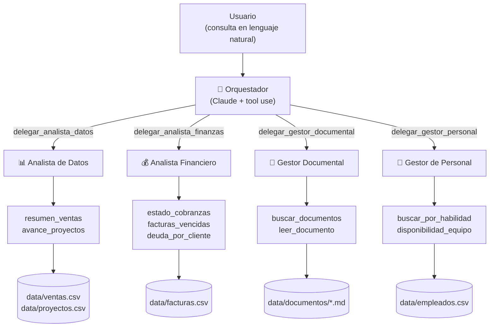

# Enterprise Agent Suite — Caso de uso IA 2026

Suite **agéntica de gestión empresarial** que demuestra la capacidad de
construir soluciones de IA aplicadas a sus dominios de negocio: **analítica de datos**,
**gestión documental** y **gestión de personal**.

Un agente **orquestador** recibe consultas en lenguaje natural, las delega en agentes
**especialistas** (cada uno con sus propias herramientas sobre los datos de la empresa)
y sintetiza una única respuesta. Se usa por **CLI** o por **chat web** (API HTTP).



## Inicio rápido

Requiere Python 3.10+. **No hace falta clave de API para evaluar el proyecto**: sin
`ANTHROPIC_API_KEY` la suite corre en modo demo (mock determinístico, sin llamadas
externas) con el mismo flujo agéntico completo.

```bash
pip install -e ".[dev]"

# Demo con los 5 escenarios de negocio
enterprise-agents demo

# Consulta libre
enterprise-agents ask "¿Qué facturas vencidas hay que reclamar?"

# Con -v se ven las delegaciones y llamadas a herramientas
enterprise-agents -v ask "Armá un equipo con Python"

# Chat web + API HTTP en http://localhost:8000
enterprise-agents serve

# Set de evaluación (6 escenarios con criterios verificables)
enterprise-agents eval
```

Para usar el modelo real (Claude):

```bash
cp .env.example .env       # completar ANTHROPIC_API_KEY
export ANTHROPIC_API_KEY=sk-ant-...
enterprise-agents ask --live "¿Cuánto facturamos a Banco Andino y quién puede tomar su próximo proyecto?"
```

## Verificación

```bash
python -m pytest      # 26 tests (herramientas + bucle agéntico + API + evaluación)
ruff check .          # lint
ruff format --check . # formato
```

El pipeline de CI (`.github/workflows/ci.yml`) ejecuta lint, tests y la demo offline
como smoke test en cada push.

## Estructura del repositorio

```
├── data/                      # Datos de ejemplo (ventas, proyectos, empleados, documentos)
├── docs/
│   ├── arquitectura.md        # Diseño de la solución y camino a producción
│   ├── casos-innovacion.md    # Investigación: casos de innovación que fundamentan el proyecto
│   ├── guia-vibecoding.md     # Prácticas de desarrollo asistido por IA usadas aquí
│   └── adr/                   # Decisiones de arquitectura (ADRs)
├── src/enterprise_agents/
│   ├── orchestrator.py        # Orquestador (patrón agente-como-herramienta)
│   ├── agents/                # Bucle agéntico + 4 especialistas
│   ├── tools/                 # Herramientas de dominio (analítica, finanzas, documentos, personal)
│   ├── llm/                   # Capa LLM: cliente Anthropic + cliente mock
│   ├── api.py                 # API HTTP (FastAPI) + chat web (static/index.html)
│   ├── evals.py               # Set de evaluación de escenarios
│   └── cli.py                 # CLI: demo / ask / eval / serve
└── tests/                     # Suite de tests (sin llamadas externas)
```

## Documentación

| Documento | Contenido |
|---|---|
| [docs/memoria-descriptiva.md](docs/memoria-descriptiva.md) | Memoria descriptiva del proyecto: motivación, objetivos, solución, metodología y resultados |
| [docs/documento-funcional.md](docs/documento-funcional.md) | Documento funcional: requerimientos, casos de uso y **guía de prueba paso a paso** |
| [docs/especificaciones-tecnicas.md](docs/especificaciones-tecnicas.md) | Especificaciones técnicas: stack, módulos, contratos, seguridad, testing |
| [docs/arquitectura.md](docs/arquitectura.md) | Arquitectura multi-agente, flujo de una consulta, decisiones técnicas y evolución a producción |
| [docs/casos-innovacion.md](docs/casos-innovacion.md) | Casos de innovación en gestión empresarial con IA agéntica que sirvieron de puntapié inicial |
| [docs/guia-vibecoding.md](docs/guia-vibecoding.md) | Mejores prácticas de *vibecoding* / desarrollo asistido por IA aplicadas en este repositorio |
| [docs/adr/](docs/adr/) | Registro de decisiones de arquitectura (ADRs) |
| [CLAUDE.md](CLAUDE.md) | Contexto para agentes de código que trabajen sobre este repositorio |

## Alcance

Este repositorio es un **caso de uso demostrativo** (entrega sin deploy): los datos son
sintéticos y las herramientas leen archivos locales. La sección *"Camino a producción"*
de [docs/arquitectura.md](docs/arquitectura.md) describe cómo cada componente se
conecta a sistemas reales (data warehouse, repositorio documental, HRIS) sin cambiar
la arquitectura.
