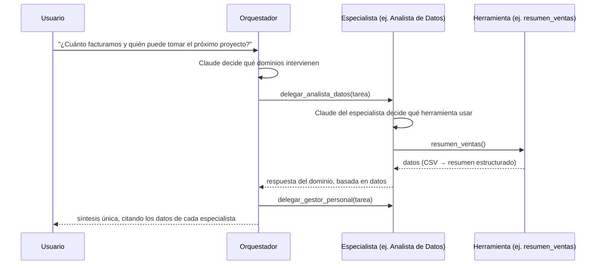

# Arquitectura de la solución

## Objetivo

Demostrar, con un caso ejecutable, cómo Dicsys puede construir soluciones **agénticas**
para gestión empresarial: un sistema donde modelos de IA no solo responden texto sino
que **deciden, delegan y ejecutan herramientas** sobre los datos de la organización.

## Visión general

La suite implementa el patrón **orquestador + especialistas** (también llamado
*agent-as-tool* o coordinador multi-agente):

Cada agente tiene:

- un **system prompt** propio que define su rol, límites y estilo de respuesta;
- un conjunto de **herramientas** con esquema JSON declarado (la Messages API de
  Anthropic las expone al modelo vía *tool use*);
- el mismo **bucle agéntico** (`agents/base.py`): llamar al modelo → si pide
  herramientas, ejecutarlas y devolver los resultados → repetir hasta respuesta final,
  con límite de iteraciones.

## Componentes

| Capa | Módulo | Responsabilidad |
|---|---|---|
| Interfaz | `cli.py`, `api.py`, `static/` | CLI (`demo`/`ask`/`eval`/`seguridad`/`serve`/`version`), API HTTP y superficies web |
| Orquestación | `orchestrator.py` | Orquestador con los especialistas expuestos como herramientas de delegación |
| Agentes | `agents/base.py`, `agents/specialists.py` | Bucle agéntico común; prompts y armado de cada especialista |
| Herramientas | `tools/analytics.py`, `tools/finance.py`, `tools/documents.py`, `tools/hr.py` | Lógica de dominio determinística sobre `data/` |
| LLM | `llm/anthropic_client.py`, `llm/mock_client.py`, `llm/router.py` | Acceso al modelo detrás de una interfaz única (`LLMClient`); ruteo semántico del cliente simulado |
| Recuperación | `recuperacion/` | Motor híbrido: fragmentación, BM25, espacio latente derivado del corpus y fusión de rankings |
| Evaluación | `evals.py`, `evaluacion/` | Escenarios de negocio; conjunto etiquetado, métricas con umbrales y verificación de fundamentación |
| Seguridad | `seguridad/`, `auth.py` | Saneamiento del contenido no confiable y suite de ataques; sesiones, claves y RBAC |
| Observabilidad | `trazas.py`, `tokens.py`, `registro.py` | Árbol de spans por consulta, estimación de tokens sin red y registro acotado en memoria |
| Memoria | `memoria.py` | Historial por sesión con presupuesto de contexto, compactación y contextualización de repreguntas |
| Configuración | `config.py` | Variables de entorno, rutas, modelo por defecto |
| Publicación | `versionado.py` | Versión, `CHANGELOG` y release derivados de los mensajes de commit |

### Separación clave: razonamiento vs. ejecución

El modelo **nunca accede directo a los datos**: decide *qué* herramienta llamar y con
*qué* argumentos; la ejecución es código Python determinístico, testeable y auditable.
Esto da tres garantías:

1. **Trazabilidad** — cada dato de una respuesta proviene de una herramienta concreta.
   Cada ejecución deja un árbol de spans (`trazas.py`) con qué agente llamó a qué
   herramienta, con qué argumentos, cuánto tardó y cuántos tokens inyectó al contexto;
   se ve con `-v` en la CLI y en `/trazas`. Ese árbol es lo que le permite al
   verificador de fundamentación exigir que toda cifra afirmada exista en la salida
   de alguna herramienta de *esa misma* ejecución.
2. **Seguridad** — los argumentos generados por el modelo se validan (por ejemplo,
   `leer_documento` bloquea *path traversal*), y los errores vuelven al modelo como
   `tool_result` con `is_error` en lugar de romper el flujo. Además, el contenido
   documental es **entrada no confiable**: pasa por `seguridad.sanear()` antes de
   volver como `tool_result`, y los permisos por rol se aplican al construir el
   agente —no en el prompt— así que un especialista prohibido directamente no existe.
3. **Testeabilidad** — las herramientas se testean como funciones puras; el bucle
   agéntico se testea end-to-end con el cliente mock.

### Capa LLM intercambiable

`LLMClient` es un protocolo con dos implementaciones:

- **`AnthropicLLMClient`** — cliente real sobre la Messages API (`claude-opus-5`,
  razonamiento adaptativo activo por defecto, prompt caching del system prompt,
  manejo explícito de `stop_reason == "refusal"`).
- **`MockLLMClient`** — simulación determinística que recorre el mismo bucle
  (selección de herramienta → ejecución → síntesis). Permite evaluar el repositorio
  sin credenciales y hace estables los tests. La selección **no es por palabras
  clave**: un router semántico (`llm/router.py`) compara la consulta contra el texto
  de intención de cada herramienta —nombre, descripción y enunciados de ejemplo—
  usando el mismo motor de recuperación del corpus documental. Rutear es recuperar,
  con las herramientas como corpus (ADR-0008).

El historial de mensajes usa el formato de la Messages API en ambas implementaciones,
por lo que **el bucle agéntico es uno solo** y no hay ramas por modo.

## Flujo de datos de la demo

| Dominio | Fuente demo | Equivalente en producción |
|---|---|---|
| Analítica | `data/ventas.csv`, `data/proyectos.csv` | Data warehouse (Snowflake/BigQuery/Redshift) vía SQL parametrizado |
| Finanzas | `data/facturas.csv` | ERP / sistema de facturación vía API |
| Documental | `data/documentos/*.md` (30 documentos, recuperación híbrida léxica + semántica) | Mismo pipeline con un `Embedder` preentrenado y un índice aproximado (ANN) para el volumen real |
| Personal | `data/empleados.csv` | HRIS vía API, con control de acceso por rol |

## Camino a producción

La arquitectura está pensada para que el paso a producción **no cambie el diseño**,
solo las implementaciones de las herramientas y la infraestructura alrededor.

### Lo que ya está resuelto en el repositorio

Estas piezas no son promesas de diseño: están implementadas, testeadas y son
ejecutables sin credenciales.

| Preocupación de producción | Cómo está resuelta hoy | Qué cambia a escala real |
|---|---|---|
| Búsqueda documental por significado | Motor híbrido BM25 + espacio latente del corpus, con fusión de rankings y abstención cuando la consulta no está cubierta | Se reemplaza el `Embedder` por uno preentrenado y se agrega un índice ANN; el resto del pipeline queda igual |
| Memoria y contexto largo | Historial por sesión con presupuesto de tokens, compactación extractiva y reescritura de repreguntas | Se agrega persistencia por usuario; la política de recorte ya existe |
| Gobernanza de accesos | RBAC de tres roles aplicado **al construir el agente**: el especialista de un dominio prohibido no se instancia | Se conecta a la identidad corporativa (SSO); el punto de control no se mueve |
| Auditoría | Árbol de spans por consulta con agente, herramienta, argumentos, latencia y tokens, filtrado por propietario | Se exporta a un backend de trazas (OpenTelemetry) en vez de un registro en memoria |
| Entrada no confiable | Todo contenido documental delimitado y saneado antes de volver como `tool_result`, con suite de ataques ejecutable | Se suma revisión del canal de ingesta de documentos, que acá está fuera de alcance |
| Evaluación continua | Conjunto etiquetado de 55 consultas con umbrales que rompen el build, más verificación de fundamentación | Se agrega un job programado contra el modelo real y se amplía el conjunto |

### Lo que falta

1. **Conectores reales** — reemplazar los lectores de CSV/Markdown por conectores al
   DWH, al gestor documental y al HRIS. El contrato `ToolDef` no cambia.
2. **Escritura de datos** — la suite es de solo lectura. Habilitar acciones que
   modifiquen estado exige confirmación humana explícita e idempotencia, que son
   decisiones de producto además de técnicas.
3. **Canales** — la API HTTP (FastAPI), el chat web y la versión móvil ya están
   implementados como fachadas sobre `crear_orquestador()`; siguen Slack/Teams y el
   portal interno.
4. **Escalado del patrón** — nuevos dominios (compras, soporte) se agregan creando un
   especialista con sus herramientas y sumándolo a la lista del orquestador: el resto
   del sistema no se toca. Los cuatro dominios actuales se construyeron así.

## Decisiones registradas

Las decisiones estructurales están documentadas como ADRs en [`docs/adr/`](adr/):

- [ADR-0001 — Arquitectura multi-agente orquestador + especialistas](adr/0001-arquitectura-multiagente.md)
- [ADR-0002 — SDK de Anthropic, modelo y bucle agéntico propio](adr/0002-sdk-anthropic-y-modelo.md)
- [ADR-0003 — Modo demo offline (mock) como ciudadano de primera clase](adr/0003-modo-mock.md)
- [ADR-0004 — Superficie web y design system propio](adr/0004-superficie-web-y-design-system.md)
- [ADR-0005 — Autenticación por sesión y roles](adr/0005-autenticacion-y-roles.md)
- [ADR-0006 — Versionado automático desde los mensajes de commit](adr/0006-versionado-automatico.md)
- [ADR-0007 — Recuperación híbrida con embeddings derivados del corpus](adr/0007-recuperacion-hibrida-sin-modelo-externo.md)
- [ADR-0008 — Ruteo semántico de herramientas en el cliente simulado](adr/0008-ruteo-semantico-en-el-cliente-mock.md)
- [ADR-0009 — Arnés de evaluación y verificación de fundamentación](adr/0009-evaluacion-y-fundamentacion.md)
- [ADR-0010 — Defensa en profundidad contra inyección de prompt](adr/0010-seguridad-inyeccion-de-prompt.md)
- [ADR-0011 — Observabilidad: trazas de ejecución y estimación de tokens](adr/0011-observabilidad-y-trazas.md)
- [ADR-0012 — Memoria conversacional con compactación y contextualización](adr/0012-memoria-conversacional.md)
