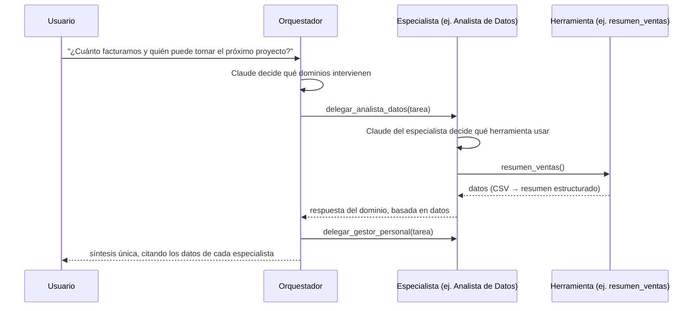

# Arquitectura de la solución

## Objetivo

Demostrar, con un caso ejecutable, cómo Dicsys puede construir soluciones **agénticas**
para gestión empresarial: un sistema donde modelos de IA no solo responden texto sino
que **deciden, delegan y ejecutan herramientas** sobre los datos de la organización.

## Visión general

La suite implementa el patrón **orquestador + especialistas** (también llamado
*agent-as-tool* o coordinador multi-agente):

Cada agente tiene:

- un **system prompt** propio que define su rol, límites y estilo de respuesta;
- un conjunto de **herramientas** con esquema JSON declarado (la Messages API de
  Anthropic las expone al modelo vía *tool use*);
- el mismo **bucle agéntico** (`agents/base.py`): llamar al modelo → si pide
  herramientas, ejecutarlas y devolver los resultados → repetir hasta respuesta final,
  con límite de iteraciones.

## Componentes

| Capa | Módulo | Responsabilidad |
|---|---|---|
| Interfaz | `cli.py`, `api.py`, `static/index.html` | CLI (`demo`/`ask`/`eval`/`serve`), API HTTP y chat web |
| Orquestación | `orchestrator.py` | Orquestador con los especialistas expuestos como herramientas de delegación |
| Agentes | `agents/base.py`, `agents/specialists.py` | Bucle agéntico común; prompts y armado de cada especialista |
| Herramientas | `tools/analytics.py`, `tools/finance.py`, `tools/documents.py`, `tools/hr.py` | Lógica de dominio determinística sobre `data/` |
| LLM | `llm/anthropic_client.py`, `llm/mock_client.py` | Acceso al modelo detrás de una interfaz única (`LLMClient`) |
| Configuración | `config.py` | Variables de entorno, rutas, modelo por defecto |
| Evaluación | `evals.py` | Set de escenarios con criterios verificables (mock y live) |

### Separación clave: razonamiento vs. ejecución

El modelo **nunca accede directo a los datos**: decide *qué* herramienta llamar y con
*qué* argumentos; la ejecución es código Python determinístico, testeable y auditable.
Esto da tres garantías:

1. **Trazabilidad** — cada dato de una respuesta proviene de una herramienta concreta
   (con `-v` se loguea cada llamada).
2. **Seguridad** — los argumentos generados por el modelo se validan (por ejemplo,
   `leer_documento` bloquea *path traversal*), y los errores vuelven al modelo como
   `tool_result` con `is_error` en lugar de romper el flujo.
3. **Testeabilidad** — las herramientas se testean como funciones puras; el bucle
   agéntico se testea end-to-end con el cliente mock.

### Capa LLM intercambiable

`LLMClient` es un protocolo con dos implementaciones:

- **`AnthropicLLMClient`** — cliente real sobre la Messages API (`claude-opus-5`,
  razonamiento adaptativo activo por defecto, prompt caching del system prompt,
  manejo explícito de `stop_reason == "refusal"`).
- **`MockLLMClient`** — simulación determinística por palabras clave que recorre el
  mismo bucle (selección de herramienta → ejecución → síntesis). Permite evaluar el
  repositorio sin credenciales y hace estables los tests.

El historial de mensajes usa el formato de la Messages API en ambas implementaciones,
por lo que **el bucle agéntico es uno solo** y no hay ramas por modo.

## Flujo de datos de la demo

| Dominio | Fuente demo | Equivalente en producción |
|---|---|---|
| Analítica | `data/ventas.csv`, `data/proyectos.csv` | Data warehouse (Snowflake/BigQuery/Redshift) vía SQL parametrizado |
| Finanzas | `data/facturas.csv` | ERP / sistema de facturación vía API |
| Documental | `data/documentos/*.md` (búsqueda léxica) | Repositorio documental con búsqueda semántica (embeddings + RAG) |
| Personal | `data/empleados.csv` | HRIS vía API, con control de acceso por rol |

## Camino a producción

La arquitectura está pensada para que el paso a producción **no cambie el diseño**,
solo las implementaciones de las herramientas y la infraestructura alrededor:

1. **Conectores reales** — reemplazar los lectores de CSV/Markdown por conectores al
   DWH, al gestor documental y al HRIS. El contrato `ToolDef` no cambia.
2. **Memoria y contexto largo** — para sesiones largas, activar *compaction* de la
   API y/o un almacén de memoria persistente por usuario.
3. **Gobernanza** — permisos por herramienta (qué usuario puede consultar datos de
   personal), registro de auditoría de cada llamada, y política de datos sensibles
   en los prompts.
4. **Evaluación continua** — convertir los escenarios de la demo en un set de
   evaluación con respuestas esperadas, y correrlo en CI contra el modelo real en
   un job programado.
5. **Canales** — la API HTTP (FastAPI) y el chat web ya están implementados como
   fachadas sobre `crear_orquestador()`; siguen Slack/Teams y el portal interno.
6. **Escalado del patrón** — nuevos dominios (finanzas, compras, soporte) se agregan
   creando un especialista con sus herramientas y sumándolo a la lista del
   orquestador: el resto del sistema no se toca.

## Decisiones registradas

Las decisiones estructurales están documentadas como ADRs en [`docs/adr/`](adr/):

- [ADR-0001 — Arquitectura multi-agente orquestador + especialistas](adr/0001-arquitectura-multiagente.md)
- [ADR-0002 — SDK de Anthropic, modelo y bucle agéntico propio](adr/0002-sdk-anthropic-y-modelo.md)
- [ADR-0003 — Modo demo offline (mock) como ciudadano de primera clase](adr/0003-modo-mock.md)
- [ADR-0004 — Superficie web y design system propio](adr/0004-superficie-web-y-design-system.md)
- [ADR-0005 — Autenticación por sesión y roles](adr/0005-autenticacion-y-roles.md)
- [ADR-0006 — Versionado automático desde los mensajes de commit](adr/0006-versionado-automatico.md)
- [ADR-0007 — Recuperación híbrida con embeddings derivados del corpus](adr/0007-recuperacion-hibrida-sin-modelo-externo.md)
- [ADR-0008 — Ruteo semántico de herramientas en el cliente simulado](adr/0008-ruteo-semantico-en-el-cliente-mock.md)
