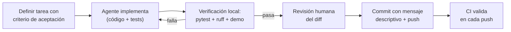

# Guía de vibecoding: desarrollo asistido por IA en este proyecto

Este proyecto fue construido con desarrollo asistido por IA ("vibecoding") aplicando
prácticas que lo hacen **sostenible y verificable**, no solo rápido. Esta guía
documenta esas prácticas para replicarlas en proyectos de Dicsys.

## Principios

### 1. El repositorio es el contexto del agente

Un agente de código trabaja bien cuando el repositorio se explica solo:

- **`CLAUDE.md` en la raíz** — contexto operativo para agentes: cómo correr tests,
  convenciones, límites ("no commitear secretos", "docs en español").
- **ADRs en `docs/adr/`** — cada decisión estructural queda escrita con su
  justificación; el agente (y el humano) siguiente no la re-litiga a ciegas.
- **README ejecutable** — todos los comandos del README funcionan tal cual; son el
  smoke test natural de cualquier cambio.

### 2. Verificación automática antes que confianza

El código generado por IA se valida igual (o más) que el humano:

- **Tests primero de la lógica determinística** — las herramientas de dominio son
  funciones puras con tests unitarios; el bucle agéntico tiene tests end-to-end.
- **El mock hace testeable lo no determinístico** — la capa `LLMClient` permite
  testear el flujo agéntico completo sin red y sin costo, en milisegundos.
- **CI en cada push** — lint (`ruff check`), formato (`ruff format --check`),
  tests (`pytest`) y la demo offline como smoke test. Si el agente rompe algo,
  se ve antes del merge.

### 3. Iteraciones chicas con criterio de aceptación

Cada pedido al agente se formula con un resultado verificable ("la búsqueda
documental debe bloquear path traversal; agregá el test que lo demuestra") en lugar
de "mejorá la seguridad". El diff resultante se revisa como cualquier PR.

### 4. El agente decide, el código ejecuta (también en el producto)

La misma disciplina del proceso se aplica al producto: el modelo elige herramientas,
pero la ejecución es código determinístico validado. Nunca se le da al modelo
acceso directo a datos o filesystem sin una función intermedia auditable.

### 5. Secretos y datos fuera del código

- Credenciales solo por variables de entorno (`.env` ignorado por git,
  `.env.example` como plantilla documentada).
- Datos de la demo sintéticos: ninguna información real de clientes o empleados.

## Flujo de trabajo recomendado

## Checklist para nuevos proyectos asistidos por IA

- [ ] `CLAUDE.md` (o equivalente) con contexto operativo del repo
- [ ] Estructura `src/` + tests desde el primer commit
- [ ] Lint y formato configurados (`ruff`) y aplicados en CI
- [ ] Toda integración externa detrás de una interfaz con implementación mock
- [ ] ADR por cada decisión estructural
- [ ] `.env.example` documentado; secretos jamás en el repo
- [ ] Escenarios de demo ejecutables sin credenciales (evaluabilidad)
- [ ] Mensajes de commit que expliquen el *por qué*, no solo el *qué*
- [ ] Convención de commits que la máquina pueda leer (versión y changelog
      derivados, no redactados a mano)
